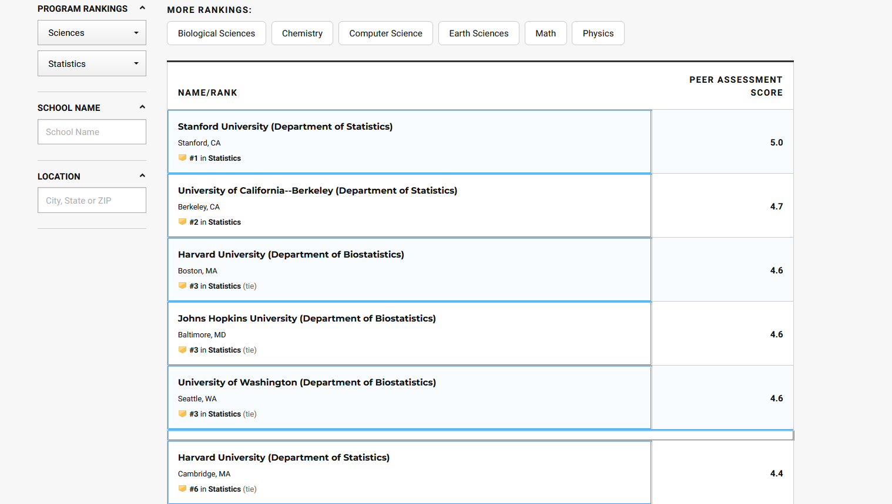

```{r, include = FALSE}
# This fixes a scrollbar not appearing for a better overall appearance
options(width=300)
```
When it comes to looking at PhD programs it can be difficult to find reliable resources that allow you to compare and constrast programs en masse.  For something that seems so important of a decision it seems strange the expectation is to hunt one-by-one through university websites to try and find program data, and even stranger that most programs do not publicly divulge all sorts of information on admissions and graduation.

There were a few resources I wanted to try and pool together to get a better idea on programs, and thus began this minor project.

By the end of this the goal is to have two dataframes, one for Statistics PhD programs and another for Biostatistics PhD programs, and try to scrape program size, USNews ranking, and presence of a consulting center.

```{r, message = FALSE, results = 'hide'}
library(pdftools)
library(tidyverse)
library(magrittr)
# OR load all of Tidyverse at once:
# tidyverse_packages() %>% lapply(library, character.only = TRUE)
```

To start off lets pull some information from the [ASA Statistics and Biostatistics Degree Data](https://www.amstat.org/asa/education/Statistics-and-Biostatistics-Degree-Data.aspx), specifically the list of universities granting PhD's in Statistics and Biostatistics and how many PhD's were granted between 2003 and 2018.

```{r}
# URL locations
stat.phdnums.loc <-
  "https://ww2.amstat.org/misc/StatsPhD2003-MostRecent.pdf"

biostat.phdnums.loc <-
  "https://ww2.amstat.org/misc/BiostatsPhD2003-MostRecent.pdf"

# Reading in PDF's
stat.phdnums <-
  pdf_text(stat.phdnums.loc) %>%
  read_lines()

biostat.phdnums <-
  pdf_text(biostat.phdnums.loc) %>%
  read_lines()

```

Here we can see the raw format the data is in.

```{r}
stat.phdnums
```

Lets drop the last two lines indicating a footnote and the totals along with the first three rows.

```{r}
stat.phdnums <- stat.phdnums %>% head(-2) %>% tail(-3)
biostat.phdnums <- biostat.phdnums %>% head(-2) %>% tail(-3)
```

And then lets drop the empty character entries that indicate a newpage.

```{r}
stat.phdnums <- stat.phdnums %>%
  lapply(function(ele)
    if (ele == "")
      NULL
    else
      ele) %>%
  compact()

biostat.phdnums <- biostat.phdnums %>%
  lapply(function(ele)
    if (ele == "")
      NULL
    else
      ele) %>%
  compact()
```

From here we're good to start utilizing `stringr` to tidy things up.

```{r, include = FALSE, eval = FALSE}
#stat.phdnums[-1] %>% 
#  substring(3) %>% 
#  str_replace_all("[^[:alnum:]]", " ") %>% 
#  str_squish() %>% 
#  strsplit(split = "(?<=[a-zA-Z])\\s*(?=[0-9])", perl = TRUE)

#biostat.phdnums[-1] %>% substring(3) %>% str_replace_all("[^[:alnum:]]", " ") %>% str_squish() %>% strsplit(split = "(?<=[a-zA-Z])\\s*(?=[0-9])", perl = TRUE) %>% unlist() %>% matrix(ncol = 2, byrow = TRUE) %>% data.frame()
statphd <-
  stat.phdnums[-1] %>%
  substring(3) %>%
  str_replace_all("B55", " ") %>%
  str_replace_all("[^[:alnum:]]", " ") %>%
  str_squish() %>%
  strsplit(split = "(?<=[a-zA-Z])\\s*(?=[0-9])", perl = TRUE) %>%
  unlist() %>%
  matrix(ncol = 2, byrow = TRUE) %>%
  data.frame() %>%
  separate("X2", into = paste0("X", 2:18), sep = " ")  %>%
  as_tibble() %>%
  mutate_at(vars(-X1), as.numeric) %>%
  mutate_at(vars(X1), as.character)

biostatphd <-
  # Cutting off the first row which is the column names
  biostat.phdnums[-1] %>%
  # Ignoring the first three characters as a minor hack
  # to remove rank as str_squish handles a few leftover leading spaces
  substring(3) %>%
  # This is to specifically handle Columbia's B55 string on the Statistics pdf
  str_replace_all("B55", " ") %>%
  # Moving to only alphanumeric chars with regex
  str_replace_all("[^[:alnum:]]", " ") %>%
  # Dropping excess whitespace as prep for second regex
  str_squish() %>%
  # Separating at first numeric into two strings
  strsplit(split = "(?<=[a-zA-Z])\\s*(?=[0-9])", perl = TRUE) %>%
  # Unlisting to form a mtrix
  unlist() %>%
  # Making the matrix
  matrix(ncol = 2, byrow = TRUE) %>%
  # Turning it into a data.frame for separate
  data.frame() %>%
  # And finishing things up by separating the second string of values
  separate("X2", into = paste0("X", 2:18), sep = " ") %>%
  as_tibble() %>%
  mutate_at(vars(-X1), as.numeric) %>%
  mutate_at(vars(X1), as.character)

biostatphd
```

```{r, message = FALSE}
stat.phd <-
  stat.phdnums[-1] %>%
  str_squish() %>%
  str_remove("^\\s*\\d*\\s*") %>%
  str_split("\\s+(?=\\d)") %>%
  unlist() %>%
  matrix(ncol = 18, byrow = TRUE) %>%
  set_colnames(value =
                 stat.phdnums[1] %>%
                 str_squish() %>%
                 str_split("\\s+(?=\\d)") %>%
                 unlist) %>%
  as_tibble() %>%
  type_convert()
```

A short explanation of each step is provided below. The site [Regex101](https://regex101.com/) is helpful with writing regex.

```{r}
biostat.phd <-
  # Ignores column names
  biostat.phdnums[-1] %>%
  # Removing excess whitepace
  str_squish() %>%
  # Removes index
  str_remove("^\\s*\\d*\\s*") %>%
  # Split on all whitespace occurring before digits
  str_split("\\s+(?=\\d)") %>%
  # Turn list into a matrix
  unlist() %>%
  matrix(ncol = 18, byrow = TRUE) %>%
  # Handling variables names
  set_colnames(value =
                 biostat.phdnums[1] %>%
                 str_squish() %>%
                 str_split("\\s+(?=\\d)") %>%
                 unlist) %>%
  as_tibble() %>%
  # Transformating variables into  numeric
  type_convert()
```

Let's take a look at how this looks completed:

```{r}
stat.phd %>% (function(x)rbind(head(x),tail(x)))
biostat.phd %>% (function(x)rbind(head(x),tail(x)))
```

Now, regarding USNews Statistics PhD Rankings...

# USNews Rankings

I tried a few tools like [SelectorGadget](https://cran.r-project.org/web/packages/rvest/vignettes/selectorgadget.html) to simplify scraping the relevant portions of the CSS but USNews' format was more unwieldly than it seemed capable of handling. There was also [this](https://github.com/tidyverse/rvest/issues/17) interesting, but old, `rvest` issue about this with a method of handling a different area of USNews rankings.  

My solution was to simply copy and paste as it skipped going deeper into HTML, XML, and CSS entirely with 30 seconds of effort.



```{r, eval = FALSE, include = FALSE}
# Used to turn copied text to file
usnewsrankings = read.table("clipboard", sep = "\n")
saveRDS(usnewsrankings, file = paste0(dirname(rstudioapi::getSourceEditorContext()$path), "/usnewsrank.RDS"))
```

```{r, include = FALSE}
load("usnewsrank.Rda")
```

The small bit of code to read my clipboard into R:

```{r, eval = FALSE}
usnewsrankings <- read.table("clipboard",sep = "\n")
```

Taking a look at what this prints as:

```{r}
usnewsrankings %>% (function(x)rbind(head(x),tail(x)))
```

Should this process change the original copied data can be found [here](http://www.brandonpipher.com/post/2020-05-03-extracting-text-with-r-in-a-tidy-fashion/usnewsrank.RDS).  Note downloading this might throw an error if you don't use `download.file(path, destfile, mode = "wb")` as the default `mode = "w"` seems to adjust headers.

Lets clean this by first removing the "RNP in Statistics" entries and selecting only the program and peer ranking.  This will leave us with only the schools name and rank.

```{r}
usnewsrankings <- usnewsrankings[usnewsrankings != "RNP in Statistics"][c(TRUE, FALSE, TRUE)]
usnewsrankings %>% (function(x)rbind(head(x),tail(x)))
```

Now for cleaning this up:

```{r}
usnewsrankings %<>% 
  # Drop tabs
  str_replace("\t","") %>%
  # Form a matrix
  matrix(ncol = 2, byrow = TRUE) %>%
  # Column names
  set_colnames(c("Program","Rank")) %>%
  # Into a tibble
  as_tibble() %>%
  # Making Rank numeric
  # Coercing NA is intended here!
  mutate(Rank = as.numeric(Rank))
```

And here we have the USNews ranking cleaned up:

```{r}
usnewsrankings %>% (function(x)rbind(head(x),tail(x)))
```

Splitting these into Statistics and Biostatistics programs requires first manually modifying an entry with Rutgers University.

```{r}
usnewsrankings[40,1] <-
  c("Rutgers University--New Brunswick (Department of Statistics)")
usnewsrankings %<>%
  add_row(Program = "Rutgers University--New Brunswick (Department of Biostatistics)",
          Rank = 3.3,
          .after = 40)
```

Then we can split based on a few specific keywords.

```{r}
biostat.keywords = c("biostatistic",
                     "health",
                     "medicine")
stat.phd.rank <-
  usnewsrankings %>%
  filter(!str_detect(Program,
                     regex(
                       paste(biostat.keywords,
                             collapse = '|'),
                       ignore_case = TRUE
                     )))

biostat.phd.rank <-
  usnewsrankings %>%
  filter(str_detect(Program,
                    regex(
                      paste(biostat.keywords,
                            collapse = '|'),
                      ignore_case = TRUE
                    )))
```

And here we are with the USNews rankings per program.  Given this information is only updated every four years, with the next to be done in 2022, this should remain relevant for some time.

```{r}
stat.phd.rank %>% print(n = Inf)
biostat.phd.rank %>% print(n = Inf)
```


